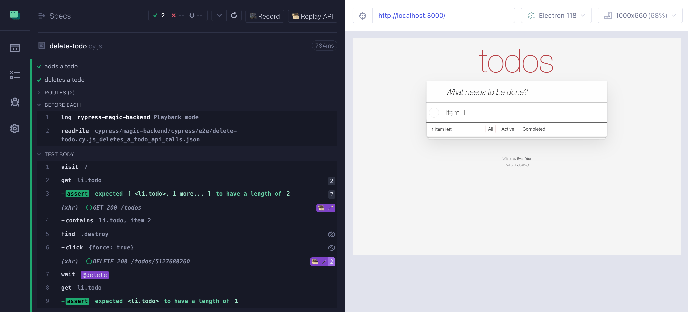
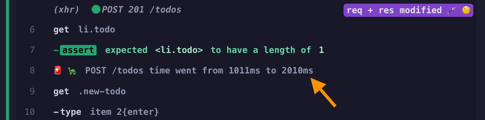
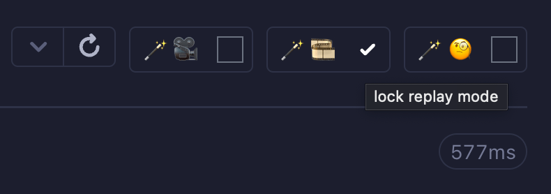

# cypress-magic-backend

> It is like a real backend but magically faster and better



## Learn

- 📝 blog post [Magic Backed For E2E Testing](https://glebbahmutov.com/blog/magic-backend/)
- 📝 blog post [Magic Backed Inspection Mode](https://glebbahmutov.com/blog/magic-backend-inspect-mode/)
- 🎁 repo [cypress-magic-backend-example](https://github.com/bahmutov/cypress-magic-backend-example)
- 📺 videos in the playlist [Cypress Magic Backend](https://www.youtube.com/playlist?list=PLP9o9QNnQuAaCiIN02Y6DUH9kS9LwA--f)
  - [Make E2E Tests Super Fast With cypress-magic-backend Plugin](https://youtu.be/ZhF0SDC1Q0g)
  - [Run Tests Separately Using cypress-magic-backend Playback Mode](https://youtu.be/VklJ76TfeQk)
  - [Record And Replay Several API Definitions](https://youtu.be/_1fnFiPMYf8)
  - [Detect API Call Duration Changes During Cypress Tests](https://youtu.be/37zTpG4tDxA)
  - [cypress-magic-backend And Your Test Network Intercepts](https://youtu.be/J-E-8eBxFaQ)

## Features and capabilities

- recording and replaying GraphQL calls would work too, since you just need to record all `POST /graphql` calls.
- works with your own `cy.intercept` spying and stubbing, since `cypress-magic-backend` is applied last. Thus your `cy.intercepts` work first
- check the current mode using the env variable `const mode = Cypress.env('magic_backend_mode')`, possible values are `undefined`, `playback`, `playback-only`, and `inspect`

## Assumptions

1. All API calls in a particular test happen in the same order and can be stubbed in that order. In the future, I will provide a way to do flexible stubbing according to your own matching rules.

## Installation

This plugin requires both Node and browser registration. To register the plugin Node code, please call its registration function from your cypress config file

```js
// cypress.config.js

const { defineConfig } = require('cypress')
// https://github.com/bahmutov/cypress-magic-backend
const registerMagicBackend = require('cypress-magic-backend/src/plugin')

module.exports = defineConfig({
  e2e: {
    setupNodeEvents(on, config) {
      registerMagicBackend(on, config)
      // IMPORTANT: return the config object
      // because it might be modified by the plugin function
      return config
    },
  },
})
```

To register the plugin's browser code, include the plugin from your E2E support file

```js
// cypress/support/e2e.js

// https://github.com/bahmutov/cypress-magic-backend
import 'cypress-magic-backend'
```

**Done!**

## Configuration

You should define which API routes the plugin should record / replay. For example, to intercept all calls to `/api` endpoint you could use the `pathname` parameter (similar to how [cy.intercept](https://on.cypress.io/intercept) defined intercepts)

```js
// cypress.config.js

const { defineConfig } = require('cypress')

module.exports = defineConfig({
  e2e: {
    env: {
      magicBackend: {
        apiCallsToIntercept: { method: '*', pathname: '/api' },
      },
    },
  },
  // the rest of the config
})
```

**Important:** make sure the config object is stored inside the `env` object of the `e2e` object, otherwise Cypress would not "combine" `env` blocks correctly. Read the blog post [Cypress v10 Environment Variables](https://glebbahmutov.com/blog/cypress-v10-env/) for more details.

```js
// 🚨 DO NOT DO THIS!
module.exports = defineConfig({
  env: {
    ...
  }
})
// ✅ CORRECT WAY
module.exports = defineConfig({
  e2e: {
    env: {
      ...
    }
  }
})
```

Sometimes the API endpoints are complicated to code using a single intercept definition. You can define an array of separate interceptors. For example, TodoMVC app might allow the following API calls only:

```js
// cypress.config.js

const { defineConfig } = require('cypress')

module.exports = defineConfig({
  e2e: {
    env: {
      magicBackend: {
        // API endpoints to intercept using an array definition
        apiCallsToIntercept: [
          { method: 'GET', pathname: '/todos' },
          { method: 'POST', pathname: '/todos' },
          { method: 'DELETE', pathname: '/todos/*' },
        ],
      },
    },
  },
  // the rest of the config
})
```

See [cypress-array.config.js](./cypress-array.config.js). Each intercept will show a number next to its alias, like `🪄 🎞️ 1`, `🪄 🎞️ 2`, etc.

### apiCallDurationDifferenceThreshold

In the `inspect` mode, the duration of each call is compared to the recorded duration. If the duration changes by more than `apiCallDurationDifferenceThreshold` limit, the test gives a warning.

```js
module.exports = defineConfig({
  e2e: {
    env: {
      magicBackend: {
        apiCallDurationDifferenceThreshold: 1000, // ms, 500 is the default
      },
    },
  },
  // the rest of the config
})
```



### Types

**Tip:** if you want code editor IntelliSense help you configure this plugin, specify the type for the `magicBackend` object using a JSDoc comment

```js
module.exports = defineConfig({
  e2e: {
    env: {
      /** @type {Partial<MagicBackend.UserConfig>} */
      magicBackend: {
        ...
      },
    },
  },
```

IntelliSense should "understand" the right properties available inside the `magicBackend` and suggest the only valid values.

## Modes

- `recording` spies on all API calls and saves a JSON file with recorded requests and responses
- `playback` stubs all API calls using the recorded JSON file. If a test does not have a recorded JSON file, the test runs normally without a magic backend
- `playback-only` stubs all API calls using the recorded JSON file. If a test does not have a recorded JSON file and the test tries to make an API call, then the test fails immediately
- `inspect` spies on all API calls in the test, comparing _types_ of the request and response objects

You can control the mode by launching the test runner with the `CYPRESS_magic_backend_mode` variable or by clicking the Magic Backend buttons in the UI.

## Lock modes

You can control the current mode by clicking on the mode buttons. Each click sets the mode and restarts the tests.

- button `🪄 🎥` runs the current spec and saves the recorded calls
- button `🪄 🎞️` runs the current spec using previously recorded network stubs
- button `🪄 🧐` compares the network calls against previously recorded list

The selected mode resets after running the current spec. If you want to keep the mode, click on the "lock mode" checkbox next to the mode button.



Then the mode will stay on, even if you restart the tests using the "Restart" button or by pressing the "R" key.

## Using on CI

Assumption: you have probably recorded backend calls using the local `cypress open` mode. Once you are happy with the recorded JSON files, you can use them on CI during `cypress run` mode. Just set the plugin to the `playback` mode via an environment variable:

```
$ CYPRESS_magic_backend_mode=playback npx cypress run
```

Here is a GitHub Actions example

```yml
- name: Cypress against static backend
  uses: cypress-io/github-action@v6
  with:
    start: npm run start:static
  env:
    # assume that all backend calls are pre-recorded
    # in the cypress/magic-backend folder
    # and on CI the API backend should be in playback mode
    # and completely stubbed
    CYPRESS_magic_backend_mode: playback
```

If a test does NOT have a recording, it will execute normally without any magic stubbing. If you want the test without a recording to fail on an API call attempt, use `CYPRESS_magic_backend_mode: playback-only` mode.

## Copyright

Copyright ©️ 2025 Gleb Bahmutov

## License

This package is double licensed. It is free to use for all non-profits, individual developers, and even small commercial organization according to the [PolyForm Small Business License 1.0.0](https://polyformproject.org/licenses/small-business/1.0.0/) license. No distribution or modification allowed.

Any commercial organization above 100 employees and individual contractors wishing to use this software (even internally for testing) is required to buy its own license. The license is strictly for non-distribution purposes, without any liability, as-is usage. You can purchase a 3-year license [here](https://buy.stripe.com/aEU18a8OyfyJ2ek5kJ).

## Misc

Color scheme used "[Holiday Vibes](https://marketplace.visualstudio.com/items?itemName=DragonsRift.holiday-vibes)"
